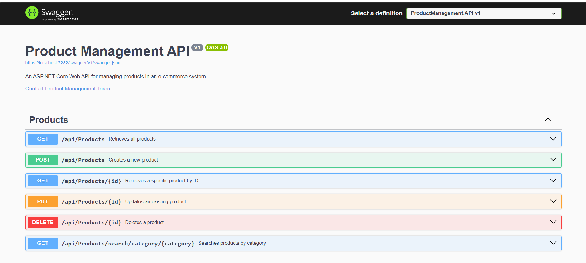

# Product Management API

A RESTful Product Management API built using ASP.NET Core 8 and Entity Framework Core. The application provides CRUD operations for products along with category-based search functionality.


## Tech Stack

- ASP.NET Core 8 Web API
- C# 12
- Entity Framework Core
- SQL Server (LocalDB)
- Swagger / OpenAPI

## Features

- Create, Read, Update, and Delete products
- Search products by category
- Entity Framework Core Code-First approach
- Dependency Injection
- Model Validation
- Logging
- Swagger API Documentation
- Asynchronous database operations

## Project Structure

```text
ProductManagement.API/
├── Controllers/
├── Data/
├── Models/
├── Services/
├── Migrations/
├── Program.cs
└── appsettings.json
```

## Product Model

```json
{
  "id": 1,
  "name": "Laptop",
  "category": "Electronics",
  "price": 999.99,
  "stock": 50,
  "createdDate": "2026-01-05T12:00:00Z",
  "updatedDate": null
}
```

## API Endpoints

```http
GET    /api/products
GET    /api/products/{id}
POST   /api/products
PUT    /api/products/{id}
DELETE /api/products/{id}

GET    /api/products/search/category/{category}
```

## Validation Rules

- Name: Required
- Category: Required
- Price: Must be greater than 0
- Stock: Must be greater than or equal to 0

## Application Flow

```text
Client Request
      ↓
Products Controller
      ↓
Product Service
      ↓
Entity Framework Core
      ↓
SQL Server Database
      ↓
Response to Client
```

## Getting Started

### Clone Repository

```bash
git clone https://github.com/sangya25-cg/Product_Management.API.git
cd ProductManagement
```

### Restore Packages

```bash
dotnet restore
```

### Apply Migrations

```bash
dotnet ef database update --project ProductManagement.API
```

### Run Application

```bash
dotnet run --project ProductManagement.API
```

### Swagger UI

```text
https://localhost:7154/swagger
```

## Configuration

```json
{
  "ConnectionStrings": {
    "DefaultConnection": "Server=(localdb)\\mssqllocaldb;Database=ProductManagementDb;Trusted_Connection=true;TrustServerCertificate=true;"
  }
}
```

## Architecture

- Controller Layer
- Service Layer
- Entity Framework Core Data Access Layer
- SQL Server Database

## Author

Sangya Ojha
